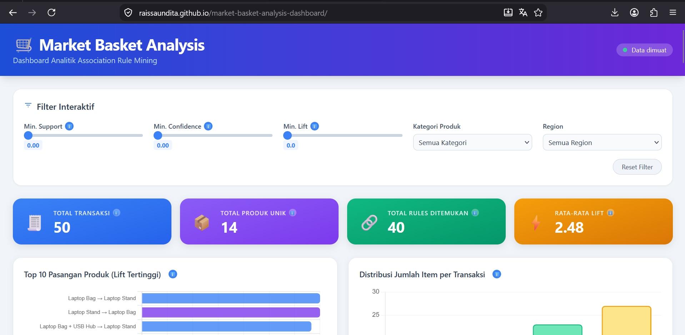
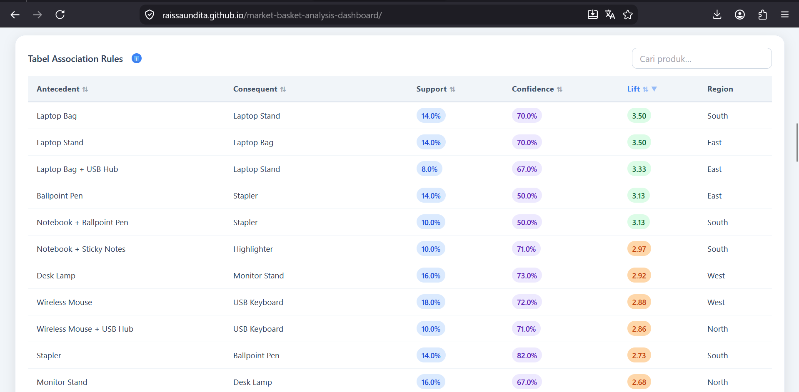
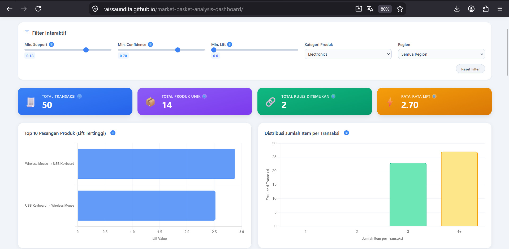

# Market Basket Analysis Dashboard

Interactive dashboard visualizing market basket analysis (Apriori algorithm) on retail transaction data. Built with Python (pandas, mlxtend) for association rule mining, and HTML/Tailwind CSS/JavaScript/Chart.js for the dashboard.

🔗 **Live Demo:** https://raissaundita.github.io/market-basket-analysis-dashboard/



## 📌 Overview

Project ini merupakan dashboard interaktif yang dikembangkan untuk memvisualisasikan hasil analisis pola pembelian pelanggan (Market Basket Analysis) pada data transaksi retail. Dashboard dibangun menggunakan pendekatan prompt layering pada AI Agent untuk menghasilkan aplikasi web berbasis HTML, Tailwind CSS, Vanilla JavaScript, dan Chart.js, dengan sumber data berupa hasil algoritma Apriori (Association Rule Mining) yang telah diproses menggunakan Python.

Tujuan utama dashboard ini adalah membantu pengguna memahami produk-produk apa saja yang cenderung dibeli bersamaan dalam satu transaksi, sehingga informasi tersebut dapat dimanfaatkan untuk strategi bisnis seperti cross-selling, penempatan produk, maupun promosi bundling.

## 🎯 Key Features

- **KPI Summary** — total transaksi, jumlah produk unik, jumlah rules ditemukan, rata-rata Lift
- **Top Product Pairs** — visualisasi 10 kombinasi produk dengan Lift tertinggi
- **Interactive Rules Table** — dapat difilter dan diurutkan berdasarkan Support, Confidence, Lift, dilengkapi pencarian nama produk
- **Heatmap Co-occurrence** — intensitas hubungan antar kategori produk
- **Regional Purchase Pattern** — perbandingan jumlah rules dominan antar region
- **Dynamic Filters** — slider Support/Confidence/Lift, dropdown Category dan Region, update real-time tanpa refresh halaman
- **Raw Data Viewer** — tab untuk melihat dataset mentah (orders.csv & rules.csv) dengan pagination, pencarian, dan tombol download
- **Tooltip Explanations** — penjelasan istilah Support, Confidence, dan Lift untuk audiens non-teknis

## 📊 Key Insights

Beberapa pola pembelian terkuat yang ditemukan dari analisis:

| Antecedent | Consequent | Support | Confidence | Lift |
|---|---|---|---|---|
| Binders, Paper | Storage | 1.06% | 19.27% | 1.24 |
| Binders, Paper | Phones | 1.08% | 19.64% | 1.21 |
| Paper, Phones | Binders | 1.08% | 30.86% | 1.17 |
| Fasteners | Paper | 1.18% | 27.44% | 1.15 |
| Binders, Phones | Paper | 1.08% | 27.14% | 1.14 |

Customer yang membeli **Binders** dan **Paper** bersamaan memiliki kecenderungan lebih tinggi untuk juga membeli **Storage** atau **Phones**, dibanding pembelian acak — insight ini bisa dimanfaatkan untuk strategi bundling atau product placement di kategori office supplies.

## 📷 Detailed Views

**Interactive Rules Table**


**Dynamic Filtering**


## 🗂️ Project Structure
```text
market-basket-analysis-dashboard/
├── data/
│   ├── orders.csv          # Data transaksi yang sudah dirapikan
│   └── rules.csv            # Hasil association rule mining
├── python/
│   ├── raw_order_data.csv  # Data transaksi mentah
│   ├── Data_Prepare.py      # Script analisis (Apriori & association rules)
│   └── requirements.txt     # Dependencies Python
├── screenshots/
│   ├── dashboard-overview.png
│   ├── rules-table.png
│   └── filter-demo.png
├── index.html
├── style.css
├── script.js
├── LICENSE
└── README.md
```

## 🛠️ Tech Stack

**Data Processing:** Python, pandas, mlxtend (Apriori algorithm)
**Dashboard:** HTML, Tailwind CSS, Vanilla JavaScript, Chart.js, PapaParse

## 🚀 How to Run

### 1. Menjalankan analisis data (opsional, hasil sudah tersedia di folder `data/`)

```bash
cd python
pip install -r requirements.txt
python Data_Prepare.py
```

Script akan menghasilkan `orders.csv` dan `rules.csv` di folder `data/`.

### 2. Menjalankan dashboard

Akses langsung lewat [live demo](https://raissaundita.github.io/market-basket-analysis-dashboard/) di atas, atau jalankan lokal menggunakan Live Server (VS Code extension) dari file `index.html`.

## 👤 Author

Raissa Undita Estiningtyas — Mahasiswa Matematika, Institut Teknologi Sepuluh Nopember
